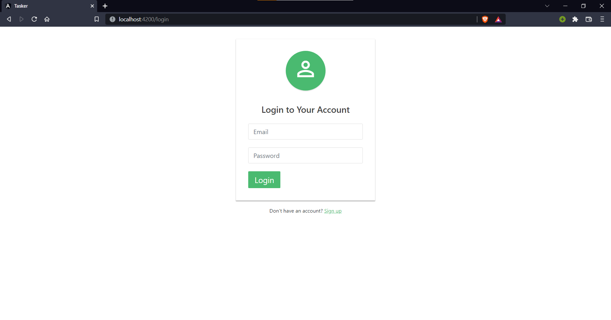
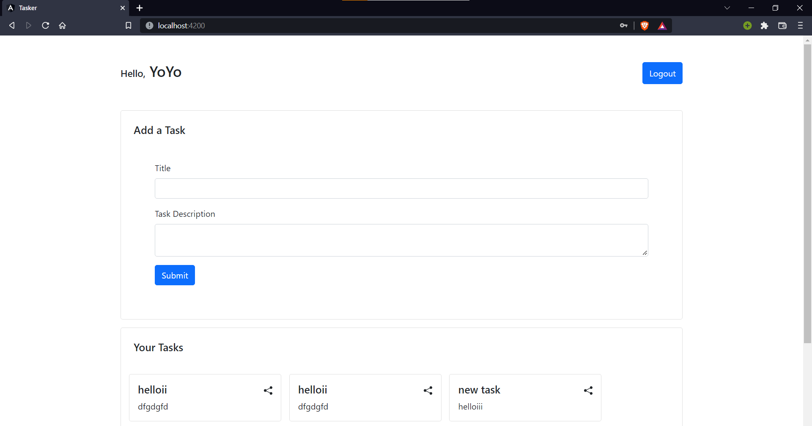
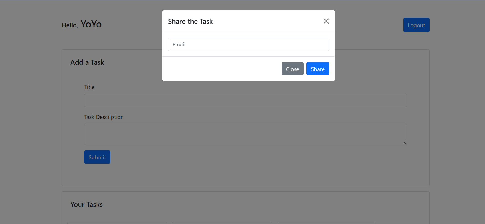
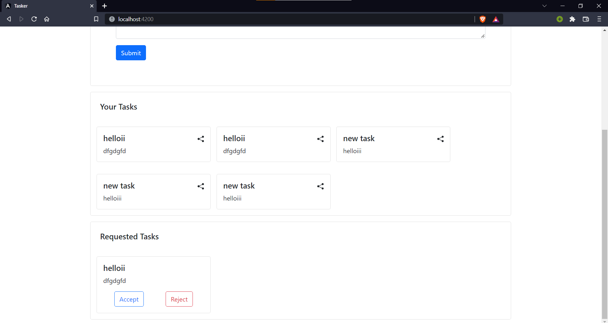

# Task Share WebApp

<br>
<br>


<br/>

### **Installation**

1. Clone the client repository 
   ```sh
   git clone https://github.com/ayushyadav9/Tasker-Assignment
   ```
2. Go to Backend and Client folder and install all npm packages
    ```sh
   npm install
    ``` 
3. Run the Node.js Server
   ```sh
   npm run server
   ```

4. Run the angular app
    ```sh
    npm start
    ```
5. App will be runing at http://localhost:4200

<br/>


<!-- USAGE EXAMPLES -->
## **Screenshots**
<div align="center" ><br/>
Login/SignUp into website<br/><hr width=600/>
  <br/><br/>
User pannel ( Add Task )<br/><hr width=600/>
  <br/><br/>
  Share a Task<br/><hr width=600/>
  <br/><br/>
  Requested Tasks<br/><hr width=600/>
  <br/><br/>
</div>
<br/>
